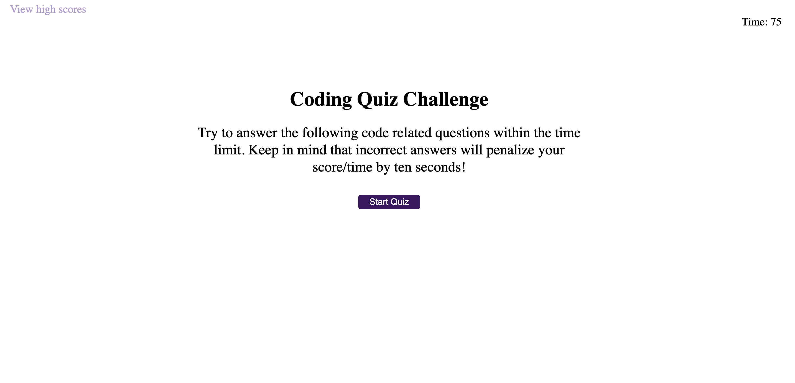

# Code-Quizing

## Purpose
This project is a portfolio of the JS, HTML, CSS and JSON information I've learned so far.

## What you will see
This project includes a timed code quiz with multiple-choice questions. The app runs in the browswer and features user-friendly interactiveness. 

When you click onto the page you will be given an intro and then have the option to select the start quiz button.
Once you start the quiz you are given 75 seconds to complete the quiz. If you anwser a question correctly you will only lose one second. 
However if you answer a question incorrectly you will be penalized and lose 10 seconds of your time.

Once you're finished answering every question you will be taken to a page that asks for your initials and once you click submit or hit enter you will be 
sent back to the beginning of the quiz.

